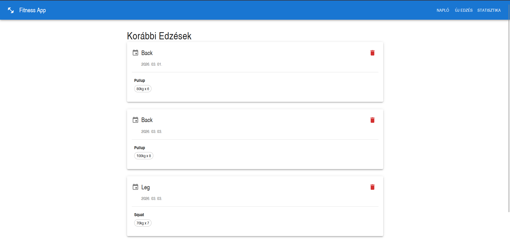
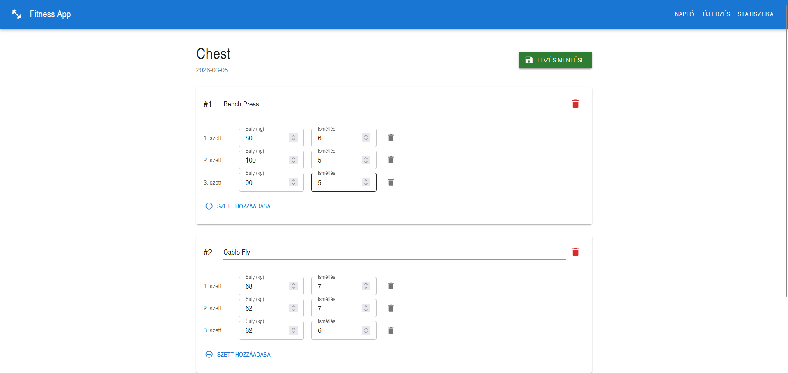
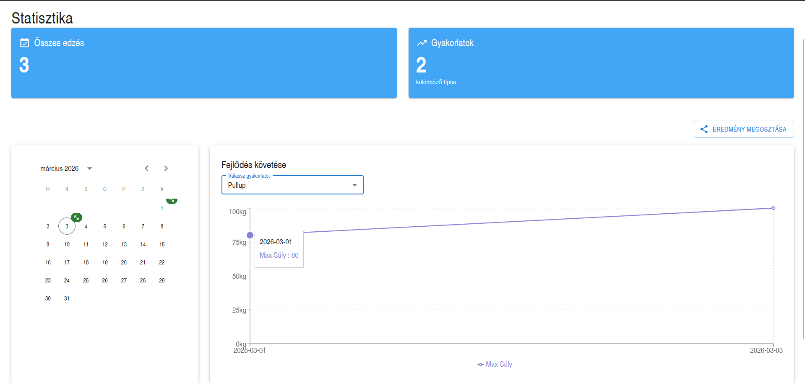
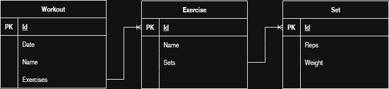

# 💪 Fitness App - Edzésnapló és Fejlődéskövető

Egy modern, full-stack webalkalmazás, amelynek célja az edzőtermi edzések egyszerű naplózása és a személyes fejlődés (progresszió) vizuális nyomon követése.

## 📌 Az alkalmazás célja
A projekt segítségével a felhasználók rögzíthetik a napi edzéseiket, az elvégzett gyakorlatokat, valamint a hozzájuk tartozó szetteket (ismétlésszám és súly). Az alkalmazás statisztikákat és grafikonokat készít a bevitt adatokból, így a felhasználó könnyedén átláthatja a fejlődését az idő múlásával.

## 🛠️ Technológiai Stack

A projekt modern iparági sztenderdek (Clean Architecture, RESTful API, Konténerizáció) alapján készült.

### Frontend
* **Keretrendszer:** React (Vite környezetben)
* **UI Könyvtár:** Material UI (kész, reszponzív komponensek a letisztult megjelenésért)
* **Típusbiztonság:** TypeScript (az adatmodellek és DTO-k szigorú tipizálásához)
* **Adatvizualizáció:** Recharts (a fejlődési grafikonok kirajzolásához)

### Backend
* **Keretrendszer:** .NET 8 / ASP.NET Core Web API
* **Adatelérés:** Entity Framework Core (Code-First megközelítés, automatikus migrációk)
* **Architektúra:** RESTful API végpontok teljes CRUD (Create, Read, Update, Delete) funkcionalitással
* **Adatkezelés:** DTO-k (Data Transfer Objects) használata a hálózati forgalom optimalizálása és az Over-Posting sebezhetőségek elkerülése érdekében

### Adattárolás & DevOps
* **Adatbázis:** Microsoft SQL Server
* **Konténerizáció:** Docker & Docker Compose (az egyszerű, egykattintásos indításért)
* **Hálózatkezelés:** NGINX Reverse Proxy (a biztonságos portkezelésért, a CORS problémák kiküszöböléséért és a frontend/backend kérések egy porton történő központosításáért)

---

## 📸 Képernyőképek

* **Kezdőképernyő / Napló:** 
* **Új edzés felvitele:** 
* **Statisztika és grafikonok:** 

---

## 🏗️ Adatbázis Struktúra (Osztálydiagram)

Az alkalmazás egy relációs adatszerkezetre épül:


* **Workout (Edzés):** Tartalmazza a dátumot és az edzés nevét.
* **Exercise (Gyakorlat):** Egy edzéshez több gyakorlat is tartozik.
* **Set (Szett):** Egy gyakorlathoz több szett (ismétlés és súly) tartozik.

---

## 🐳 Telepítés és Indítás (Lokális környezetben)

A projekt futtatásához mindössze a [Docker Desktop](https://www.docker.com/products/docker-desktop/) telepítésére van szükség.

1. Klónozd le a repót:
   ```bash
   git clone [https://github.com/FELHASZNALONEVED/fitness-app.git](https://github.com/FELHASZNALONEVED/fitness-app.git)
   cd fitness-app

2. Indítsd el a konténereket a Docker Compose segítségével:
   ```bash
   docker-compose up -d

3. Nyisd meg a böngészőt!
   Az alkalmazás (az NGINX proxy-n keresztül) a következő címen érhető el:
   http://localhost:5173